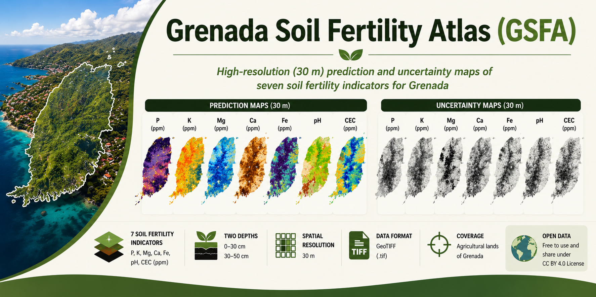

# Grenada Soil Fertility Atlas (GSFA)

## Overview

The Grenada Soil Fertility Atlas (GSFA) provides high-resolution (30 m) prediction and uncertainty maps for seven soil fertility indicators across agricultural lands in Grenada. The dataset was developed within the Soil Fertility Mapping Project (SFMP) under the Morocco–Caribbean South–South Cooperation Initiative and accompanies the Scientific Data publication.

## Dataset

The repository contains prediction and uncertainty maps for:

| Soil property | 0–30 cm | 30–50 cm |
|---------------|:-------:|:---------:|
| Available P | ✓ | ✓ |
| Exchangeable K | ✓ | ✓ |
| Exchangeable Mg | ✓ | ✓ |
| Exchangeable Ca | ✓ | ✓ |
| Available Fe | ✓ | ✓ |
| pH | ✓ | ✓ |
| CEC | ✓ | ✓ |

## Repository structure

Prediction_maps/
Uncertainty_maps/
Metadata/
Figures/

## Spatial characteristics

- Spatial resolution: 30 m
- Format: GeoTIFF (.tif)
- Study area: Grenada
- Coordinate reference system: EPSG:32620 - WGS 84 / UTM zone 20N

## Citation

xxxxxxx

## License

CC BY 4.0
